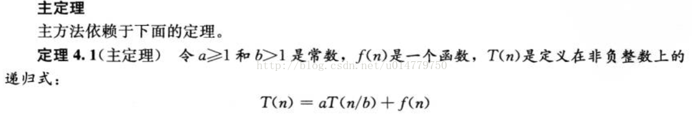
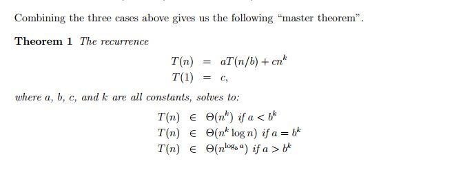

### Some notes and tips:  
 - Not all recursive functions can be defined in a Non-recursive way.  
  (For many occasions,many recursive func can be solved to an Equation(recursive push-down).  
  For example,Ackerman Func.  
 - 主定理分析递推式，来估计复杂度。  
  
 - 上面的图片说了等于没说，下面的更好一些：

### Illumination on Divide&Conquer:  
 - 大数乘法
 - Strassen 矩阵乘法
 - **第k小元素**
    - 基本概念 : 找出数组中的第k小的元素并输出.
    - 具体需求 : 从乱序的数组中快速找出第i小的元素并输出(重复的情况)
        输入 : 一组无序的数组A,
        输出 : 数组A中第k小的元素.

    - 分析 : 为了能在线性时间内快速找到第k小的元素,可以利用到二分搜索.
    - 时间复杂度 : O(n)
    - 空间复杂度 : 需要一个额外空间

    - 解决方案1 : 最实在的方法是先排序,在取第k值返回.这种方法的时间复杂度最少是O(nlogn)(选用自底向上合并排序)
     - 优缺点 : 能够确保在O(nlogn)的时间复杂度内完成,缺点是没有必要再对后面的数据进行排序.浪费大量的时间
        
    - 解决方案2 : 类似于快速排序(找一个参照值,i从左到右直到小于参照值,j从右到左直到大于参照值,然后交换a[i]和参照值,结束条件是i<=j),
                **由于快速排序有个特性,就是每一次排序后,参照值都是放置在应有的位置上.也就是说当a[i]与参照值交换后,参照值的位置是固定的.**
                参照值就是那个Pivot，一次partition确定一个Pivot。即此时i就是参照值的下标.如果i==k的话,就输出当前的参照值.
                第一遍是比较是O(n),第二次大概是O(n/2),第三次是O(n/4),比较次数相加接近O(2n),交换次数最多O(2n)次,最少是O(n)次,
                平均O(1.5n)次.其递归的关键在于递归最后一次与参照值的交换。（**已经实现在Qsort.java文件**）
